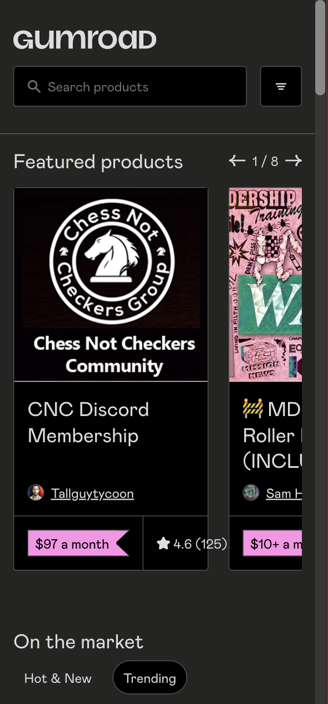
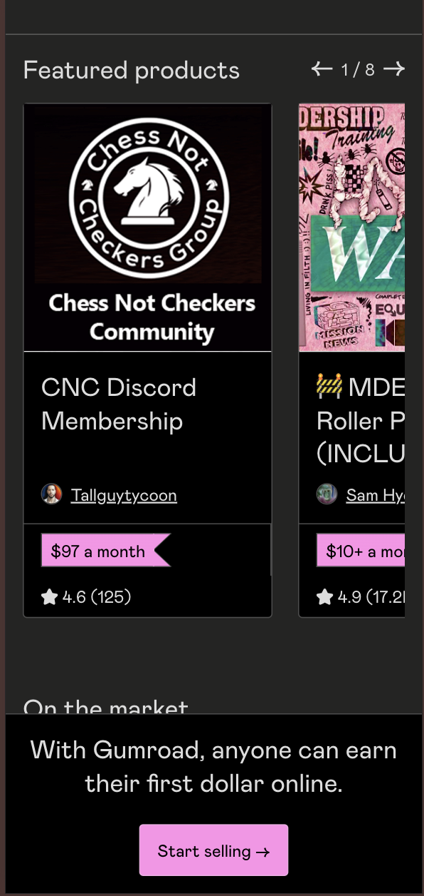

# Chrome Extension Local Installation Guide

This guide will walk you through the process of installing and using this Chrome extension locally.

## Prerequisites

- Google Chrome browser
- Git (optional, for cloning the repository)

## Installation Steps

1. Obtain the extension files:

   - Option A: Clone the git repository:
     ```
     git clone https://github.com/AgentBurgundy/gumroad-fixes.git
     ```
   - Option B: Download the repository as a ZIP file and extract it.

2. Open Google Chrome and navigate to `chrome://extensions/`.

3. Enable "Developer mode" by toggling the switch in the top right corner of the extensions page.

4. Click on the "Load unpacked" button that appears after enabling Developer mode.

5. Navigate to the folder containing the extension files and select it.

6. The extension should now be installed and visible in your Chrome browser.

## Before


## After


## Before



## After



## Usage

- After installation, you should see the extension icon in your Chrome toolbar.
- Go to Gumroad.com and see the magic!
  - Use dev tools to emulate mobile view

## Troubleshooting

- If the extension doesn't appear, try refreshing the extensions page and reloading it.
- Ensure that all necessary files are present in the extension folder.
- Check the Chrome console for any error messages related to the extension.

## Updating the Extension

To update the extension with the latest version:

1. If you cloned the repository, pull the latest changes:

   ```
   git pull
   ```

   If you downloaded the ZIP, download the latest version and replace the existing files.

2. Go to `chrome://extensions/` and click the "Reload" button for this extension.
